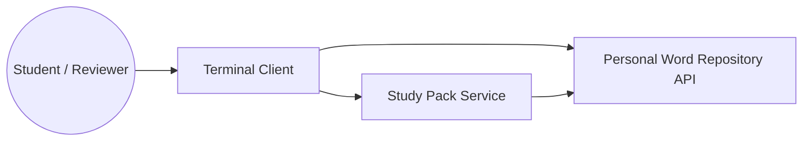

# Auxiliary Service Design

## Service purpose

The auxiliary component is a separate Flask service called `Study Pack Service`. Its purpose is to provide derived learning-oriented responses outside the main CRUD API, such as random study packs, words missing translations, and words grouped by category.

## Why it is separate

- The main API stays focused on core repository resources and CRUD behavior.
- Study-pack style responses are derived views rather than primary domain resources.
- Keeping the service separate demonstrates inter-service architecture and creates room for future synchronization or caching logic.

## Current endpoint overview

| Endpoint | Method | Query parameters | Purpose | Current status |
| --- | --- | --- | --- | --- |
| `/healthz` | `GET` | none | Health check for the service | Implemented |
| `/study-pack/random` | `GET` | `user_id`, optional `count` | Return a random-sized study pack response | Implemented with live main-API data |
| `/study-pack/missing-translations` | `GET` | `user_id` | Return words that need translation work | Implemented with live main-API data |
| `/study-pack/by-category` | `GET` | `user_id`, `category_id` | Return study items for one category | Implemented with live main-API data |

## Communication model

## Validation already implemented

- Missing `user_id` returns `400` on all study-pack endpoints that require it.
- `count` must be an integer greater than zero for `/study-pack/random`.
- Missing `category_id` returns `400` for `/study-pack/by-category`.

## Current limitation that must be stated clearly

The service now fetches live word, category, and translation data from the main API, but it still derives responses on demand and does not maintain a separate cache or persistence layer of its own.
