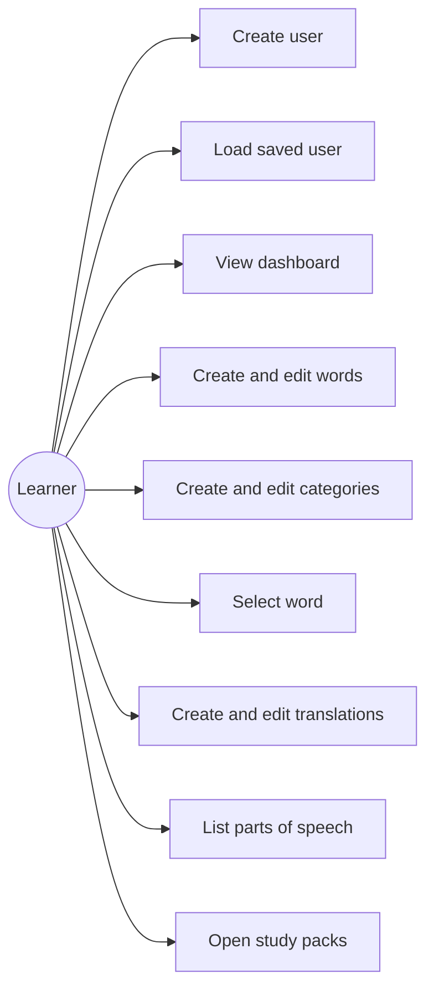
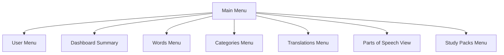
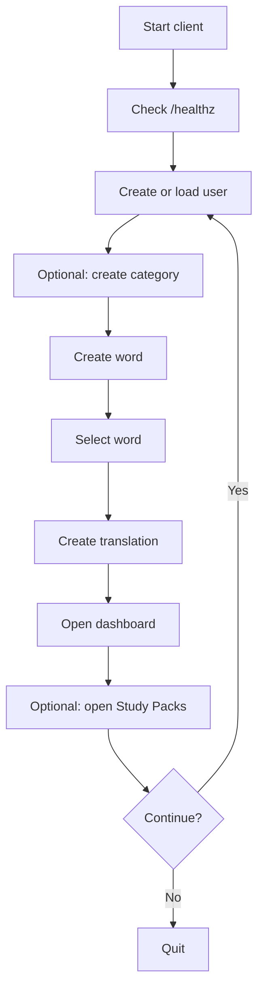

# Client Diagrams

## Use-case diagram

## Interface layout

## Workflow diagram

## Notes for the report

- These diagrams intentionally model the terminal interface, because that is the implemented client.
- If you export the report to PDF, verify Mermaid rendering first or replace these with screenshots of the same structure.
